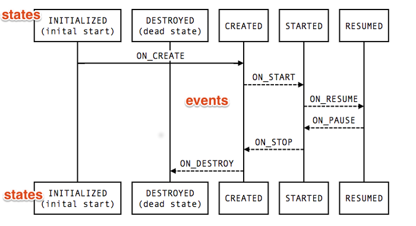

# Lifecycle & LiveData

# Lifecycle 

  + **Lifecycle** is a class that holds the information about the lifecycle state of a component (like an activity or a fragment) and allows other objects to observe this state.

  + **Lifecycle** uses two main enumerations to track the lifecycle status for its associated component:
    
    **Event:**
    The lifecycle events that are dispatched from the framework and the Lifecycle class. These events map to the callback events in activities and fragments.
    
    **State:**
    The current state of the component tracked by the Lifecycle object.
    
  
  
  ***LifecycleOwner***
  ```java
  public interface LifecycleOwner {

    Lifecycle getLifecycle();
  }
  ```
  
  ***Lifecycle***
  ```java
  public abstract class Lifecycle {

    @MainThread
    public abstract void addObserver(@NonNull LifecycleObserver observer);

    @MainThread
    public abstract void removeObserver(@NonNull LifecycleObserver observer);

    @MainThread
    @NonNull
    public abstract State getCurrentState();
    
    public enum Event {}
    
    public enum State {}
  }
  ```
      
# LiveData

  + ### The Core of LiveData
    + It wrap an normal observer with a LifecycleOwner into LifecycleBoundObserver, so that this observer is able to judge the state of its bound LifecycleOwner when LiveData call *considerNotify()* as well as to unsubscribe - *removeObserver()* the LiveData when its bound LifecycleOwner is in *DESTROYED* state.

  + ### Source Code Analysis
    + When you call observe(), LiveData binds the LifecycleOwner and Observer creating a Wrapper object (LifecycleBoundObserver). So if LifecycleOwner has state change, the wrapper object will be notified.
    ***LifecycleBoundObserver***
    ```java
    class LifecycleBoundObserver implements GenericLifecycleObserver {
      public final LifecycleOwner owner;
      public final Observer<T> observer;
      public boolean active;
      public int lastVersion = START_VERSION;

      LifecycleBoundObserver(LifecycleOwner owner, Observer<T> observer) {
        this.owner = owner;
        this.observer = observer;
      }

      @Override
      public void onStateChanged(LifecycleOwner source, Lifecycle.Event event) {
        if (owner.getLifecycle().getCurrentState() == DESTROYED) {
          removeObserver(observer);
          return;
        }
        // immediately set active state, so we'd never dispatch anything to inactive
        // owner
        activeStateChanged(isActiveState(owner.getLifecycle().getCurrentState()));
      }

      void activeStateChanged(boolean newActive) {
        if (newActive == active) {
          return;
        }
        active = newActive;
        boolean wasInactive = LiveData.this.mActiveCount == 0;
        LiveData.this.mActiveCount += active ? 1 : -1;
        if (wasInactive && active) {
          onActive();
        }
        if (LiveData.this.mActiveCount == 0 && !active) {
          onInactive();
        }
        if (active) {
          dispatchingValue(this);
        }
      }
    }
    ```
   
  + ### Overall
    
    Follow these steps to work with LiveData objects:
    1. Create an instance of LiveData to hold a certain type of data. This is usually done within your ViewModel class. (LiveData works)
    2. Create an Observer object that defines the onChanged() method, which controls what happens when the LiveData object's held data changes. You usually create an Observer object in a UI controller, such as an activity or fragment.
    3. Attach the Observer object to the LiveData object using the observe() method. The observe() method takes a LifecycleOwner object. This subscribes the Observer object to the LiveData object so that it is notified of changes. You usually attach the Observer object in a UI controller, such as an activity or fragment.

  + ##### The advantages of using LiveData
    
    + **Ensures your UI matches your data state**
      LiveData follows the observer pattern. LiveData notifies Observer objects when the lifecycle state changes. You can consolidate your code to update the UI in these Observer objects. Instead of updating the UI every time the app data changes, your observer can update the UI every time there's a change.
      
    + **No memory leaks**
      Observers are bound to Lifecycle objects and clean up after themselves when their associated lifecycle is destroyed.

    + **No crashes due to stopped activities**
      If the observer's lifecycle is inactive, such as in the case of an activity in the back stack, then it doesn’t receive any LiveData events.

    + **No more manual lifecycle handling**
      UI components just observe relevant data and don’t stop or resume observation. LiveData automatically manages all of this since it’s aware of the relevant lifecycle status changes while observing.
      
    + **Always up to date data**
      If a lifecycle becomes inactive, it receives the latest data upon becoming active again. For example, an activity that was in the background receives the latest data right after it returns to the foreground.

    + **Proper configuration changes**
      If an activity or fragment is recreated due to a configuration change, like device rotation, it immediately receives the latest available data.

    + **Sharing resources**
      You can extend a LiveData object using the singleton pattern to wrap system services so that they can be shared in your app. The LiveData object connects to the system service once, and then any observer that needs the resource can just watch the LiveData object. For more information, see Extend LiveData.

  + ##### Create LiveData objects

    + A LiveData object is usually stored within a ViewModel object and is accessed via a getter method
    + Usually the ViewModel only exposes **immutable LiveData** objects to the observers.

  + ##### Observe LiveData objects

    + In most cases, an app component’s onCreate() method is the right place to begin observing a LiveData object
    + Generally, LiveData delivers updates only when data changes, and only to active observers. An exception to this behavior is that observers also receive an update when they change from an inactive to an active state. Furthermore, if the observer changes from inactive to active a second time, it only receives an update if the value has changed since the last time it became active.
  
  + ##### Update LiveData objects

    + LiveData has no publicly available methods to update the stored data. The MutableLiveData class exposes the setValue(T) and postValue(T) methods publicly.
    
    + MutableLiveData
      + setValue(T value)
      Sets the value. If there are active observers, the value will be dispatched to them.
      This method must be called from the **main thread**. If you need set a value from a background thread, you can use postValue(Object)
      
      + postValue(T value)
      Posts a task to a main thread to set the given value.